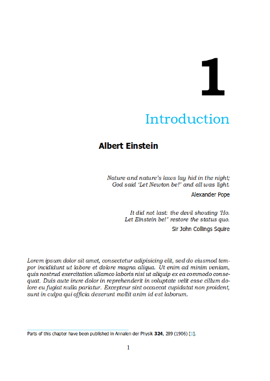
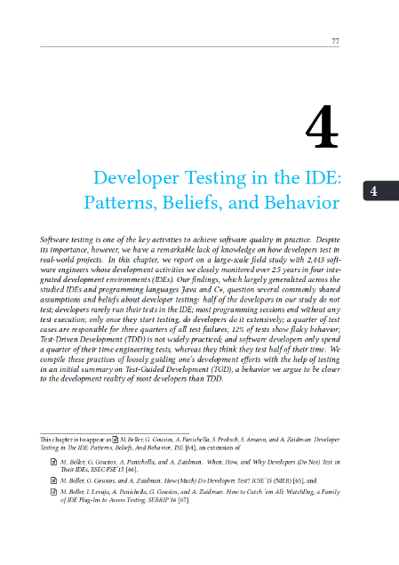
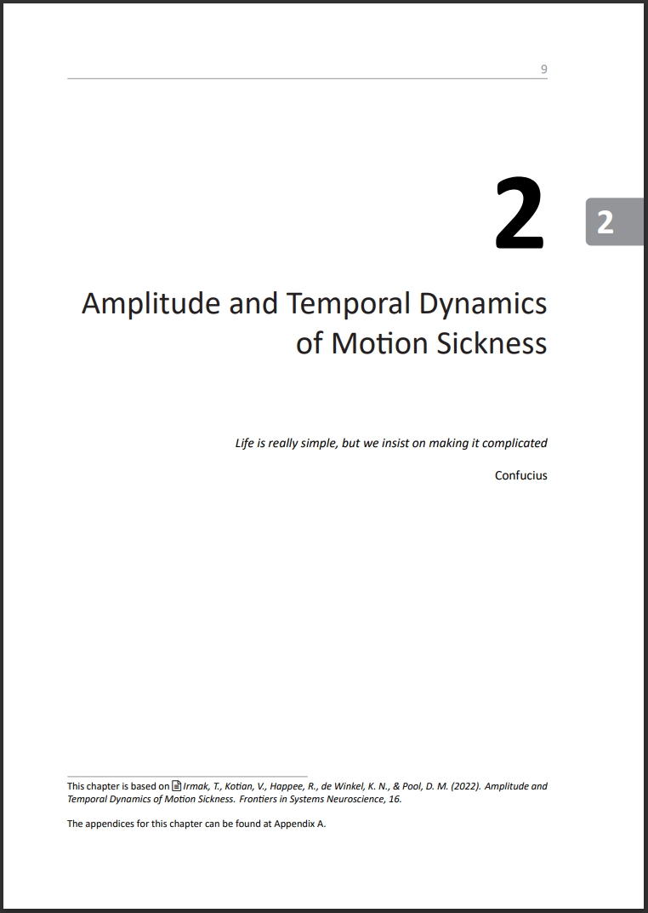
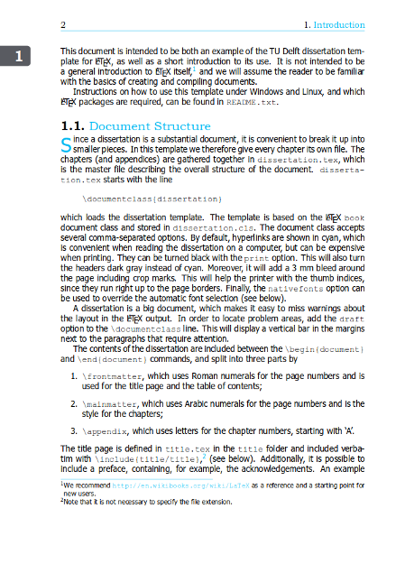
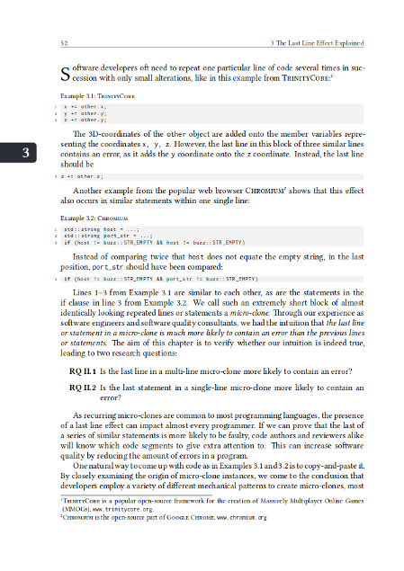
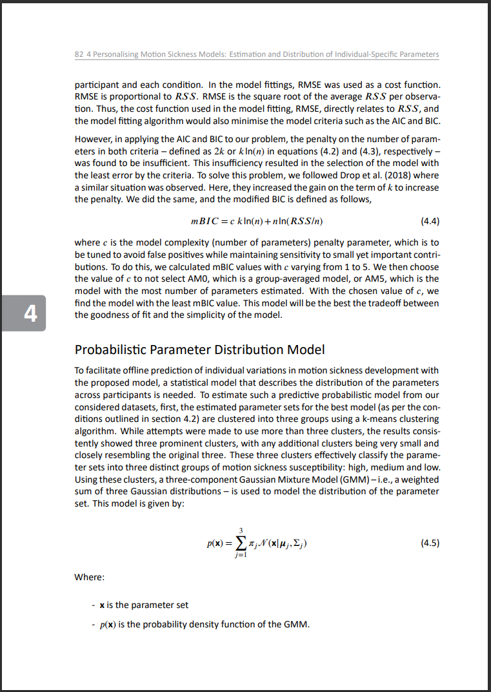

# Improved TU Delft PhD Thesis Template

This is an improved version of the [TU Delft PhD thesis
template](https://www.tudelft.nl/en/tu-delft-corporate-design/downloads/) with modifications by [Inventitech](https://github.com/Inventitech/phd-thesis-template). It
features a large number of changes to increase both on- and off-screen
readability and quality, as well as reduce printing costs. It is a
double-sided, colored dissertation style with hyperlinks (although many of
these parameters can be easily changed).

I did not create the original template. However, I would appreciate it
if you did keep the note that you are using this adopted version of
the template.

## Style

Here is a side-by-side comparison of the two styles.

| Old Style       |  Inventitech |  New (this template) |
:----------------:|:---------------------:|:---------------------:
 |  | 
 |  | 

Note that there
are small differences between the online and print versions (such as
cutter's marks to trim pages and page alignment on the print
version). These are hard to get right, and I optimized them using two
physical proof prints of my thesis.

The layout in this repository is very well-readable, but rather close
to the low limits for font size and page utilization that I would use
(i.e., if anything, I would recommend to increase font size, line
height or page margins).

## Key Improvements

Specifically, the changes in this template make these key improvements
over the TU Delft dissertation house style and Inventitech's style: It ...

- compiles well on Overleaf.
- changed the color palette.
- changed fonts.
- moved abstract to the next page instead of the chapter heading page.
- has been used successfully in my dissertation and been approved by the TU Delft Graduate School.

## Setup and Installation

See the original [README](README.txt).

There are three document options to the provided dissertation.cls style -- be sure to use `print` when sending to the printer.

## Version

This template is based on commit `ff9d073` of TU Delft's template
(dissertation template from July 2nd, 2015, strangely referred to in
the TeX document as '2013/07/08 v1.0 TU Delft dissertation class'),
which was the latest available on 13-11-2018. Unfortunately, I did not
have access to their repository.
